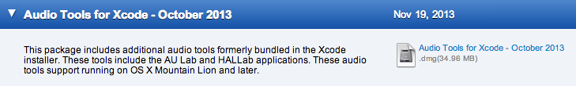
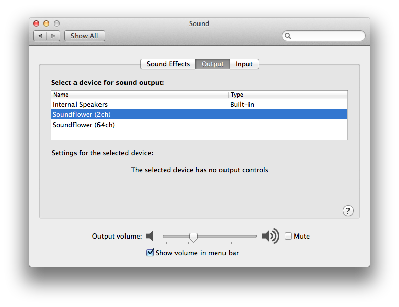

Tutorial: Live Audio Filters for Mac OS X
=============

This short tutorial will get you the tools necessary to create a wide range of real time audio filters and effects for Mac OS X.

[Download Soundflower](https://code.google.com/p/soundflower/)
This tool creates a virtual audio device that allows us to redirect the output sound back into another tool.

[Download Audio Tools for Xcode](https://developer.apple.com/downloads/index.action)
The Audio Tools for Xcode contain AU Lab, the tool we will actually create our filters in.

Open up System Preferences and set your audio output to Soundflower 2ch.

Open Audio Lab and choose Soundflower 2ch as input and you default audio device as the output.

Finally create your desired filter or equalization settings by apply an effect to 'Output 1' within the Audio Lab document.

Inspired by [Dctr Watson](http://www.dctrwatson.com/2011/06/os-x-system-equalizer/)

